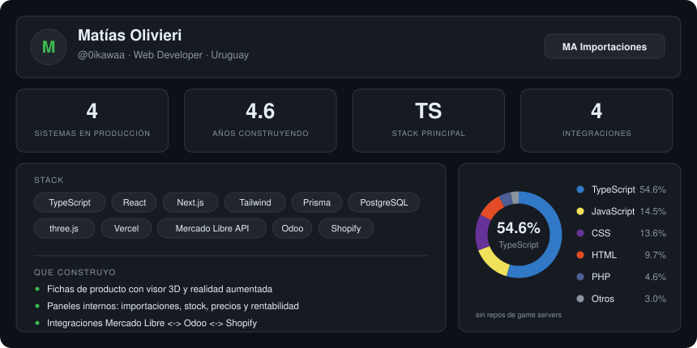

<picture>
  <source media="(prefers-color-scheme: dark)" srcset="./profile-dark.svg">
  <source media="(prefers-color-scheme: light)" srcset="./profile-light.svg">
  
</picture>

## Qué hago

Desarrollo y mantengo los sistemas de **MA Importaciones**, empresa uruguaya de comercio exterior:
el panel interno de operaciones, los catálogos web y las integraciones entre Mercado Libre, Odoo
y Shopify.

No son proyectos de portfolio. Están en producción y los usa el equipo todos los días para
publicar productos, controlar stock, calcular costos nacionalizados y seguir embarques.

## Proyectos

Los cuatro están desplegados y se pueden probar ahora mismo.

### panel-ma&nbsp;&nbsp;[`ver en vivo ↗`](https://panel-ma.vercel.app)&nbsp;&nbsp;[`código`](https://github.com/0ikawaa/panel-ma)
`Next.js 16` · `React 19` · `Prisma` · `TypeScript`
Plataforma interna que concentra el negocio en un solo lugar: importaciones (kanban de embarques,
calculadora de costo nacionalizado, lectura de Excel con fotos incrustadas en celdas), ventas
Mercado Libre + Odoo, reposición, rentabilidad y reportes. Acceso por módulos según el usuario.
Desplegado en Vercel sobre Postgres (Neon).

### mundoshop&nbsp;&nbsp;[`ver en vivo ↗`](https://mundoshop.vercel.app)&nbsp;&nbsp;[`código`](https://github.com/0ikawaa/mundoshop)
`three.js` · `Web Components` · `WebXR`
Fichas de producto con **visor 3D y realidad aumentada**. El comprador abre las puertas del ropero
en la escena 3D y después lo apoya en su propio cuarto — `.glb` para Android, `.usdz` para AR Quick
Look en iOS. Sitio estático: sin build ni dependencias de servidor.

### telas-harturo&nbsp;&nbsp;[`ver en vivo ↗`](https://telas-harturo.vercel.app)&nbsp;&nbsp;[`código`](https://github.com/0ikawaa/telas-harturo)
`HTML` · `WebP` · `sin dependencias`
Catálogo de 20 telas de tapicería para Harturo Tapicería (Montevideo). Un solo `index.html`, sin
dependencias. Imágenes extraídas en resolución nativa y servidas en WebP en tres tamaños según el
uso. En celular se pasa de tela deslizando el dedo, con resistencia en los extremos.

### web-maimpo&nbsp;&nbsp;[`ver en vivo ↗`](https://web-maimpo.vercel.app)&nbsp;&nbsp;[`código`](https://github.com/0ikawaa/web-maimpo)
`Vanilla JS` · `Google OAuth`
Sitio institucional con agenda de reuniones integrada a Google Calendar. Sin framework.

## Stack

| | |
|---|---|
| **Front** | TypeScript · React · Next.js · Tailwind · three.js |
| **Back** | Node.js · PostgreSQL · Prisma · SQLite |
| **Integraciones** | Mercado Libre API · Odoo (JSON-RPC) · Shopify · Google APIs |
| **Deploy** | Vercel · Digital Ocean |

## Cómo trabajo

Mis commits explican **por qué** se hizo el cambio, no qué línea se tocó:

> **Semáforo de la planilla: rojo hasta 15 días, amarillo hasta 40, verde después**
>
> Antes el rojo era `<= 3` días y el amarillo `<= 14`, así que casi todo lo que venía en
> camino se veía verde y el rojo aparecía cuando ya no había margen para reaccionar.

---

